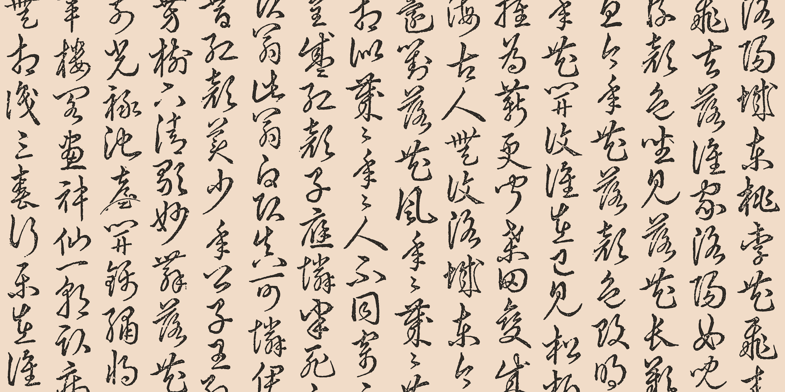
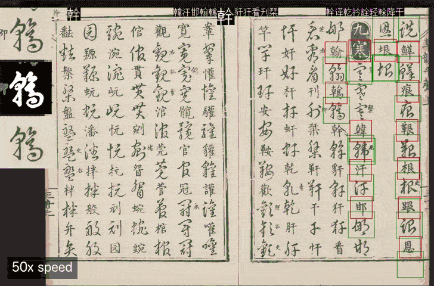
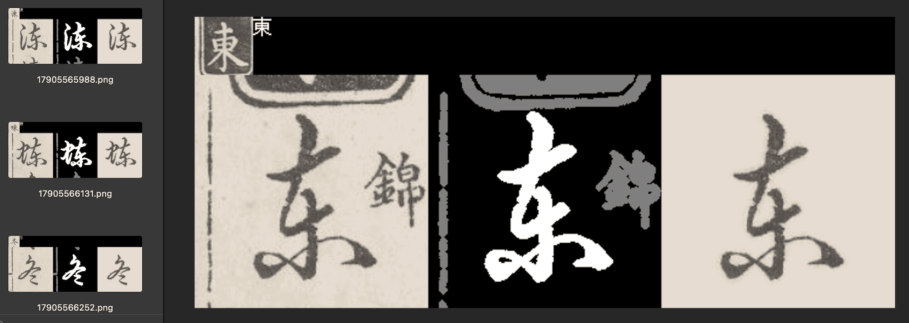
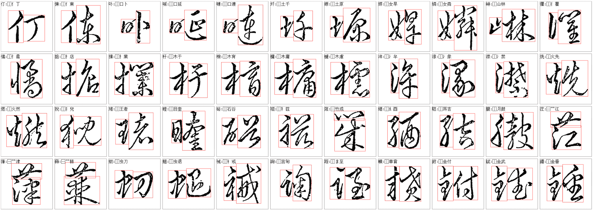
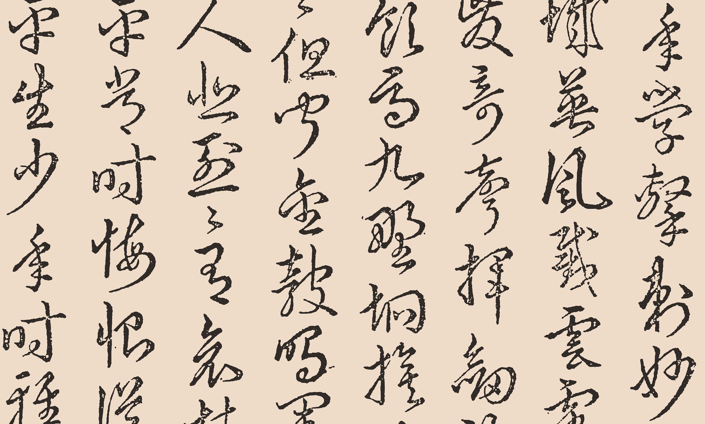
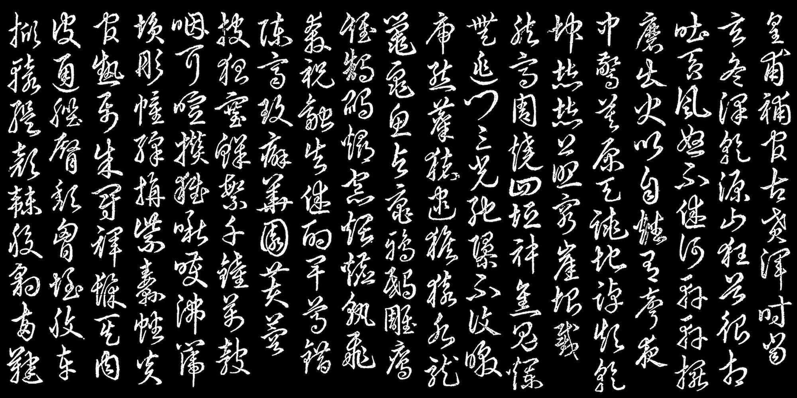
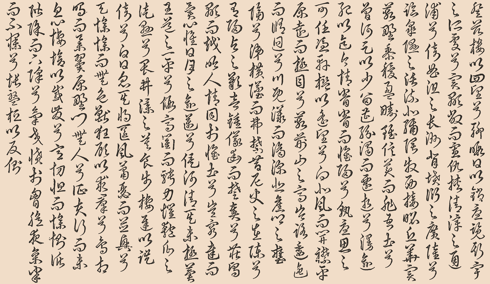
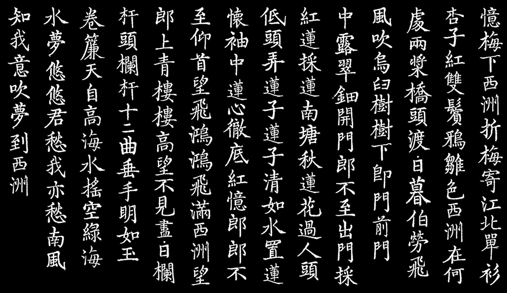
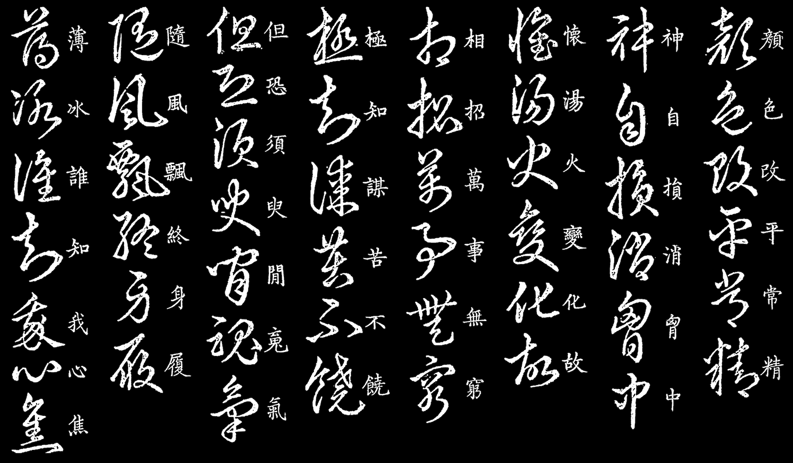

# 韻草 rhyme-grass-font

Authentic [cursive](https://en.wikipedia.org/wiki/Cursive_script_(East_Asia)) typeface extracted from the Ming Dynasty calligraphy dictionary, *[草韻辨體](http://www.chinaknowledge.de/Literature/Science/caoyunbianti.html)*.

基於明刻本之復古草書字體。

### [ [Download Font](https://github.com/LingDong-/rhyme-grass-font/releases) | [Try Online](https://rg-font.netlify.app/) | [Dataset](https://github.com/LingDong-/cybt-dataset) ]

Featuring:

- The traditional Chinese art form of grass script, or cursive handwriting.
- Letterforms originally by the greatest masters throughout history such as 右軍, 懷素 and 子昂, collected and interpreted by Ming-dynasty calligrapher [郭諶](https://zh.wikipedia.org/wiki/%E9%83%AD%E8%AB%B6_(%E6%98%8E%E6%9C%9D)), made into a computer font by the author of [qiji-font 齊伋體](https://github.com/LingDong-/qiji-font).
- Textures unique to woodblock printing, meticulously preserved.
- Extensive character set, including hundreds of obscure characters and variant forms.

The font is free to [download](https://github.com/LingDong-/rhyme-grass-font/releases) for personal and commercial use, under the terms of SIL Open Font License 1.1.

## Overview

| | |
|---|---|
| Total samples extracted from book | 13,000+ |
| **Unique characters covered by samples** | **10,000+** |
| Characters covered by variant forms | 3,000+ |
| Synthesized characters using IDS | 4,500+ |
| **Total characters covered in font** | **18,000+** |



The core part of this typeface is created through manual labelling of the calligraphy dictionary, Caoyun-Bianti (《草韻辨體》), by locating bounding boxes for each character and assigning a unicode to it. The process facilitated by the fact that the book shares (mostly) the same entries with the dictionary [洪武正韻](](https://ctext.org/wiki.pl?if=gb&res=135548)).


|  |  |
|---|---|
| Samples from dataset labels | Example output of the synthesis algorithm |

For missing characters that are neither in the book nor covered by a variant form (see [data/variants.txt](data/variants.txt), which is an effort in itself to come up with an exhaustive list of all Chinese variant forms) or strictly bijective Traditional->Simplified transformation, the program synthesizes the characters if they have a "simple", 2-component IDS structure that is usually not merged in the cursive style (e.g. 惆=⿰忄周) and both components can be sampled from the book, by compositing the glyphs.

See **workflow** section below for details.

### The Dataset

The labelled dataset for the font is available in its own repo, [LingDong-/cybt-dataset](https://github.com/LingDong-/cybt-dataset) (CC-BY-4.0). 

## Gallery

All images below are typeset with the font.





### Regular Script

As a byproduct of dataset labelling process, the regular script (楷書) character corresponding to each grass script character is also extracted. The dataset for those still requires some cleanup, and the font will be published soon. Meanwhile, here're some samples:



Combining the two fonts by placing the glyphs side by side may prove useful to people learning to read and write cursive.



## Workflow

This section documents the workflow with which the font is built, which might interest those who wish to reproduce the results or contribute to this project. To use the font, please go directly to the [Releases](https://github.com/LingDong-/rhyme-grass-font/releases).

Install the [Dither Programming Language](dither-lang.netlify.app) and [node.js](https://nodejs.org/en). The workflow is tested on macOS, and likely also work on Linux.

If you wish to work with the existing dataset, clone the separate [dataset repo](https://github.com/LingDong-/cybt-dataset) *inside* this repo:

```sh
cd rhyme-grass-font
git clone https://github.com/LingDong-/cybt-dataset.git
```

Setup the dataset repo:

```sh
cd cybt-dataset && make sync && cd ../
```

if you make modifications to the dataset, call the above again before commiting.

If you'd like to start afresh, then simply create the empty folders *inside* this repo like so:

```sh
cd rhyme-grass-font
mkdir -p cybt-dataset/labels-chr
mkdir -p cybt-dataset/labels-rad
```


Download all the other necessary resources by calling:

```sh
make dl.all
```

which includes (shout out to the authors of these resources!):

- 草韻辨體(1584) PDF from [shuge.org](https://www.shuge.org/).
- [Unifont](https://unifoundry.com/unifont/index.html) and [HanaMinB(花園明體)](https://github.com/googlefonts/chinese/tree/gh-pages/fonts/HanaMin) for displaying BMP and SIP characters in annotation tool (not used in output font).
- [IDS database](https://github.com/cjkvi/cjkvi-ids) for character decomposition information.
- [RapidOCR model files](https://huggingface.co/DjB314/RapidOCR) (optional, for OCR in the annotation tools).

Split the PDF into pages:

```sh
make gen.pages
```

Convert HanaMinB.ttf to unifont hex format by opening [tools/hana2hex.html](tools/hana2hex.html]) in a browser, uploading the font downloaded from previous step, and downloading and placing the converted file into [data/dl](data/dl/).

Start the OCR server (optional), then launch the main annotation tool, for full characters, then for radicals:

```sh
make ocr.serve
make anno.chr PAGE=11
make anno.rad
```

To edit the masks or the unicode assignment, use the following:

```sh
make maskedit.chr UNICODE=26360
make maskedit.rad UNICODE=37329
make reassign
```

To generate the glyphs from the annotations:

```sh
make vectorize.chr
make vectorize.rad
```

Compute which characters can be covered through variant forms and bijective TC->SC:

```sh
make gen.surjection
```

Synthesize the remaining characters covered by decomposition constraints:

```sh
make gen.synthplan
make gen.synth
```

Finally, produce the font file:

```sh
make gen.font
```

## Charset

A sheet of all extracted characters, rendered at 32px (click to enlarge). Each one of them took a small amount of manual labor. Enjoy the font!


-------

The core parts of project are written from scratch by hand in [Dither](https://github.com/LingDong-/dither-lang), a new programming language for creative coding, developed by the author at MIT Media Lab. You might also be interested in my [other](https://github.com/LingDong-/qiji-font) [typography](https://github.com/LingDong-/computer-grass/tree/main) [projects](https://github.com/LingDong-/duct-tape-font/).